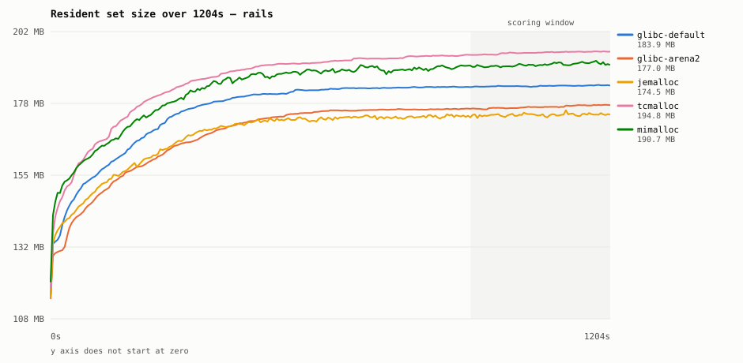

# ruby-alloc-bench — Ruby 4.0 allocator comparison

Does swapping glibc malloc for jemalloc / tcmalloc / mimalloc actually cut a
Rails process's RSS? Five lines, one machine, sequential, `LD_PRELOAD` only.

| line | how |
|---|---|
| `glibc-default` | whatever ships in `ruby:4.0-slim-trixie` |
| `glibc-arena2`  | same, `MALLOC_ARENA_MAX=2` |
| `jemalloc`      | 5.3.1, built from source |
| `tcmalloc`      | gperftools 2.18.1, `libtcmalloc_minimal.so` |
| `mimalloc`      | v3.5.1, built from source |
| `mimalloc-v2`   | v2.5.2 — v3 rewrote the free-list sharding, so v2 is a different design, not an older build |
| `snmalloc`      | 0.7.5, message-passing design |
| `glibc-trim`    | `MALLOC_ARENA_MAX=2` + `MALLOC_TRIM_THRESHOLD_=131072` |

`glibc-trim` exists for the same reason as `glibc-arena2`: arenas are not
glibc's only knob. A Rails process whose RSS will not come down is often not
fragmented, it is glibc hoarding freed memory rather than returning it —
`MALLOC_TRIM_THRESHOLD_` is what decides when it lets go.

`glibc-arena2` exists because most "jemalloc saved us 30% RSS" stories are
really glibc's per-thread arenas (default cap: 8 × cores) going wide. If one
environment variable closes the gap, that is the answer — not a C dependency.

## Results

Vultr dedicated-vCPU box, 2026-09-13. 1200s x 3 rounds x 8 lines, ~48M requests.
CPU steal held at 0.003% throughout, so the machine really was dedicated.

```
x86_64 · 2 cores · glibc 2.41 · THP always · ruby 4.0.6 · YJIT true
```



| allocator | RSS median | vs glibc | req/s | p99 ms | major GC | spread over 3 rounds |
|---|--:|--:|--:|--:|--:|--:|
| **jemalloc** | **174.5 MB** | **-5.1%** | **1751** | 17.79 | **36** | 1.33% |
| **mimalloc-v2** | **174.6 MB** | **-5.0%** | 1695 | 17.52 | 39 | 0.96% |
| glibc-trim | 176.4 MB | -4.1% | 1651 | 18.86 | 63 | 0.33% |
| glibc-arena2 | 177.0 MB | -3.7% | 1639 | 17.89 | 49 | 0.45% |
| glibc-default | 183.9 MB | +0.0% | 1662 | 18.04 | 52 | 0.04% |
| mimalloc (v3) | 190.7 MB | +3.7% | 1681 | 17.29 | 33 | 0.77% |
| tcmalloc | 194.8 MB | +5.9% | 1727 | 19.24 | 38 | 0.65% |
| snmalloc | 195.5 MB | +6.3% | 1750 | 16.65 | 40 | 0.57% |

**The differences are real.** Round-to-round spread tops out at 1.33% while the
gaps span 11.4 points, so the ranking is signal rather than luck.

**jemalloc and mimalloc v2 tie at the top**, 0.1 MB apart — inside the noise
band, so treat them as equal on memory. jemalloc takes it on the tiebreakers:
highest throughput (+5.4% over glibc) and the fewest major GCs of any line.

**mimalloc v3 is 16 MB worse than mimalloc v2** — +3.7% against -5.0%, from the
same project. v3's free-list sharding rewrite is a different allocator wearing
the same name, and the version you get from a distro package decides which one
you are running. Pin it.

**glibc's own knobs get you most of the way, and one of them is a trap.**
`MALLOC_ARENA_MAX=2` is -3.7% for a single environment variable and no
dependency — genuinely good value. Adding `MALLOC_TRIM_THRESHOLD_` buys another
0.4 points and costs 63 major GCs against glibc's 52: returning memory to the OS
churns `malloc_increase`, which makes Ruby collect more often. You paid CPU for
that last 0.4%.

**tcmalloc, snmalloc and mimalloc v3 are net negatives here.** None is
GC-starved — mimalloc v3 ran the fewest major GCs of anyone — they simply hold
more memory. THP `always` is the likely cause: all three mmap heavily and
huge-page granularity rounds that up. On a `madvise` host they may look
different; the report header records which you measured.

Raw CSVs are deliberately not committed. The harness is the artifact: anyone
who doubts the numbers can run `./bench/run.sh` and produce their own, on their
own hardware, which is worth more than trusting a table of mine.

### What this does not say

- One workload (railsbench), 5 threads, one process. A Sidekiq-shaped run at
  `concurrency: 25` would give glibc's arenas far more room to misbehave, and
  the gap could widen. See "Thread count is the variable that matters".
- Even at 1200s the curves are still creeping up very slightly. This is close
  to steady state, not absolutely at it; the ranking settles long before the
  absolute numbers do.
- 5% RSS is real but modest. Ruby-side GC tuning
  (`RUBY_GC_OLDMALLOC_LIMIT_MAX`, compaction) is untested here and may be worth
  more, with no new dependency.

## Run it

```sh
./bench/run.sh                          # 1200s × 3 rounds × 5 lines ≈ 5h
DURATION=120 ROUNDS=1 ./bench/run.sh    # smoke
WORKLOAD=synth ./bench/run.sh           # synthetic churn instead of Rails

# Add lines to an existing results/ without re-running what is already measured.
# Writing into the same directory is what lets the report compute "vs glibc".
ONLY="glibc-trim mimalloc-v2 snmalloc" ./bench/run.sh
```

Output lands in `results/`: one CSV per run, plus `REPORT.md` and
`rss-<workload>.svg`.

## Design

- **Workload**: yjit-bench's railsbench (Rails 8.1, sqlite, pinned SHA), driven
  in-process through `Rack::MockRequest` from 5 threads. Multi-threaded on
  purpose — single-threaded never triggers the glibc arena behaviour that this
  whole comparison is about. `WORKLOAD=synth` swaps in Rails-shaped allocation
  churn without Rails.
- **Concurrency**: one process, 5 threads. No Puma cluster mode: `fork` makes
  parent and child share pages, so RSS double-counts and you would have to
  measure PSS instead. That is a different benchmark.
- **Primary metric**: median RSS over the final window, after warmup. Peak RSS,
  req/s and p99 are recorded but are not what the decision hangs on.
- **`GC.stat` is recorded every sample** so you can tell "this allocator used
  less memory" apart from "this allocator made Ruby GC harder".
- **p99** comes from a per-thread ring buffer allocated before the run and
  sorted only after the last sample — computing percentiles mid-run would
  allocate inside the process being measured.
- Every round runs alone with `--cpuset-cpus=0-1 --memory=4g` and a cooldown between.
  `run.sh` preflights each line by grepping `/proc/self/maps`, so a silently
  ignored `LD_PRELOAD` fails loudly instead of producing five glibc results.

## Running it on the VPS

Target: x86_64, Debian 13, 2 dedicated vCPU / 8 GB (matches the production
target; the container already is Debian 13 + glibc 2.41 + THP `madvise`).

2 cores, not 1 and not 4: measured, under the GVL 4 cores bought 1.6% more
requests than 1. The second core is there so the sampler thread is not fighting
the workers for the same CPU.

```sh
apt-get update && apt-get install -y docker.io git
# private repo, so either add a deploy key, or just push the tree up from
# your laptop -- it is a throwaway box, not worth the auth dance:
#   rsync -a --exclude results ~/Developer/ruby-benchmark/ root@VPS:ruby-alloc-bench/
git clone git@github.com:7a6163/ruby-alloc-bench.git && cd ruby-alloc-bench

nohup ./bench/run.sh > run.log 2>&1 &
# ... 5 hours later, from your laptop:
scp -r root@VPS:ruby-alloc-bench/results .
```

`run.sh` prints CPU steal before anything else. If it is above ~1% the plan is
shared-vCPU whatever the product page says, and the timing columns are junk.

## Thread count is the variable that matters

`THREADS=5` is Rails' `RAILS_MAX_THREADS` default. It is also what decides
whether the glibc arena comparison shows anything: glibc hands each thread its
own arena on first `malloc`, and the GVL does not prevent that — it only stops
them running in parallel. Core count merely caps the total (8 × cores), and 5
threads never reaches that cap.

So if production runs something wider — Sidekiq at `concurrency: 25`, say —
sweep it:

```sh
THREADS=25 ./bench/run.sh
```

That is where `MALLOC_ARENA_MAX=2` earns its keep, and a 5-thread run cannot
see it.

## CI

`.github/workflows/bench.yml` runs on `ubuntu-24.04-arm` (same arch as the
local M1 baseline). All five lines share one runner — a matrix would compare
five different machines.

- push / PR → 90s × 1 round. This is a **harness check**, not data: it proves
  the image builds, every `LD_PRELOAD` still loads, and the report renders.
- `workflow_dispatch` / weekly cron → 600s × 3 rounds (~2.5h, inside the 6h
  job cap).

Treat CI timing numbers as unusable: GitHub runners are shared vCPUs with
noisy neighbours, and req/s/p99 swing well beyond the effect being measured.
RSS holds up better but still deserves a local confirmation before you change
anything in production.
